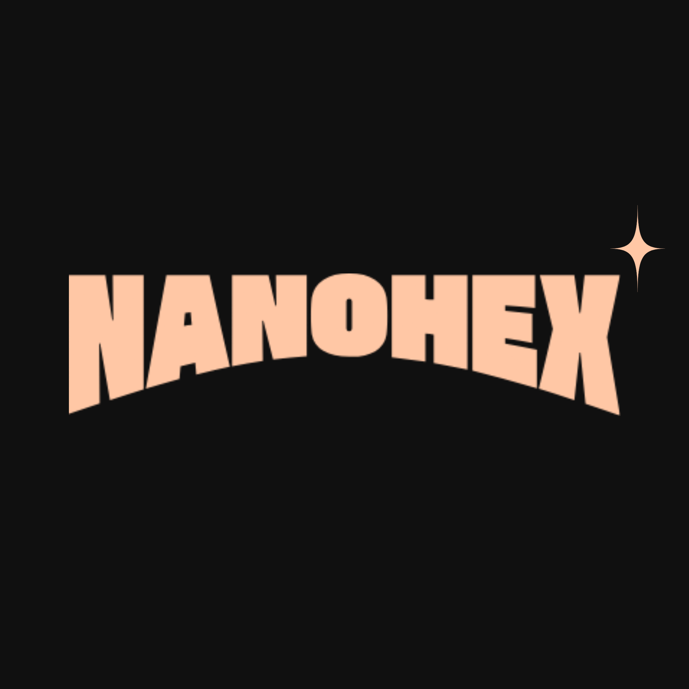

# <p align="center" style="height: 300px;"></p>
<p align="center">
  <strong>A human-readable, highly efficient pixel art image format.</strong>
</p>

---

## 🚀 About NanoHex (.nhx)
NanoHex is a custom image format designed specifically for small-scale pixel art. Unlike binary formats, `.nhx` files are plain-text, making them easy to read, edit by hand, and debug. Created with **Python** and **Pillow**, it bridges the gap between raw data and visual art.

### Why NanoHex?
* **Human Readable:** Edit your pixels directly in a text editor.
* **Indexed Color:** Uses a 16-color palette system to keep data light.
* **Developer Friendly:** Designed for 17-year-olds and veterans alike to understand how image data mapping works.

---

## 📊 Storage Comparison
NanoHex punches way above its weight class for small assets. Here is how the `cat` asset compares across formats:

| Format | File Size |
| :--- | :--- |
| **Standard PNG** | 56 KB |
| **Standard JPG** | 13.8 KB |
| **NanoHex (.nhx Text)** | **2.2 KB** |
| **NanoHex Rendered PNG** | 3.8 KB |

---

## 🖼️ Visuals
| Original Image | .nhx Rendered Output |
| :---: | :---: |
|  |  |

---

## 🛠️ How to Use

### Prerequisites
You need Python 3 and the Pillow library installed:
```bash
pip install Pillow
```
Add the image file to the `encoder.py` select a `.png` extension file and create a `.nhx` file where the data will be written down by the encoder. Then go to the decoder add the same `.nhx` file and a `.png` file will be created. Custom sizes and maximum color limit can also be provided.

## 📃Contribute
If you want to contribute to this project, then help me out with,
* **CLI interface for the encoder and decoder**
* **Better perfomance and speed**

---
Thank you for your attention. Looking forward to make this project better and more awesome projects ahead.
